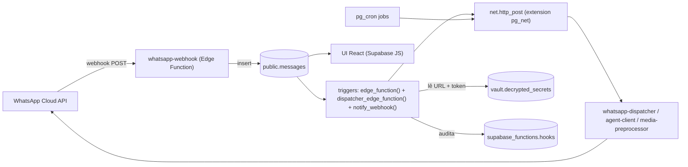
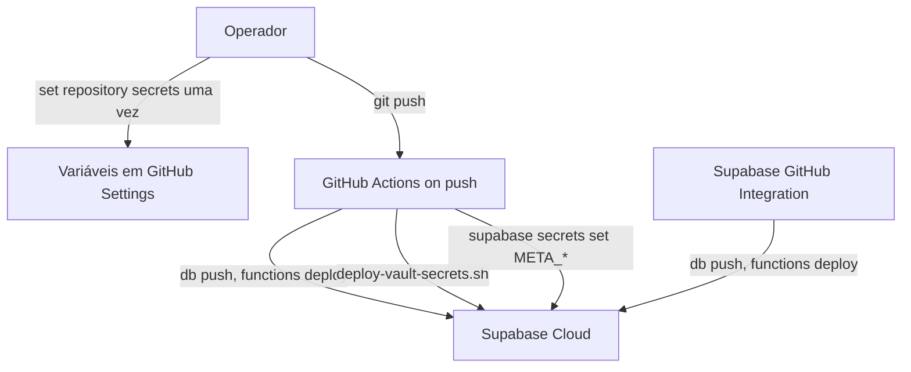

# Auditoria Técnica — `open-bsp-api` / `wakit-api`

Análise profunda do fork em [github.com/Guiwilly2001/open-bsp-api](https://github.com/Guiwilly2001/open-bsp-api) versus o repositório original [github.com/matiasbattocchia/open-bsp-api](https://github.com/matiasbattocchia/open-bsp-api) (rebrand para `wakit-api`), à luz do que tivemos de corrigir manualmente nesta sessão.

---

## 1. Resumo executivo (TL;DR)

| Pergunta | Resposta direta |
|----------|------------------|
| O projeto é “self-host em 15 minutos” como promete o README? | **Não.** Em um projeto Supabase **novo de 2025/2026**, ele falha silenciosamente em pelo menos 4 pontos antes do primeiro envio/recepção de WhatsApp funcionar. |
| Há acoplamento oculto com o ambiente original do autor? | **Sim.** O projeto pressupõe Supabase com `pg_net`, `supabase_vault` e o schema legado `supabase_functions` já criados — coisas que vinham por padrão em projetos antigos e **não vêm mais** em projetos novos. |
| Está arquiteturalmente incompleto? | **Estruturalmente sim**: o bootstrap declarativo (`schemas/`) e as migrations **usam** objetos que não criam e **dependem de secrets** que não populam pela via padrão (Supabase GitHub Integration). |
| Há risco de quebras futuras? | **Sim.** Qualquer mudança da Supabase em comportamentos legados (`supabase_functions`, vault auto, extensions defaults) pode quebrar todos os forks atuais. Já aconteceu — é a causa do que vimos. |
| O deploy automático é reprodutível? | **Parcialmente.** O `supabase db push` + `supabase functions deploy` rodam, mas vault, extensions, schema legado e secrets Meta exigem ação humana ou um workflow secundário (`Release`) que está marcado `workflow_dispatch:` only. |
| O fork é seguro? | **Hoje sim, depois das correções manuais.** Sem versionar essas correções, **um próximo redeploy num projeto novo** te força a repetir tudo. |

A solução não é “mais um patch”; é **fechar o gap de bootstrap** com 1 migration declarativa + descomentar extensions + automatizar vault, o que devolve o projeto à promessa “fork → deploy → live”.

---

## 2. Mapa da arquitetura real

### 2.1 Fluxo de dados (o que **deveria** acontecer)



Cada seta vermelha abaixo é uma **dependência implícita** que, se faltar, quebra a cadeia:

| Aresta | Dependência | Onde foi declarada? |
|---|---|---|
| `triggers → vault.decrypted_secrets` | `supabase_vault` extension | **Não** declarada (comentada em [`00_extensions.sql`](api/supabase/schemas/00_extensions.sql)) |
| `triggers → net.http_post` | `pg_net` extension | **Não** declarada (mesmo arquivo) |
| `triggers → supabase_functions.hooks` | Schema/tabela legados | **Nunca** declarados em parte alguma do repo |
| `triggers → vault.decrypted_secrets (edge_functions_url/token)` | 2 secrets reais | `deploy-vault-secrets.sh` só roda no workflow `Release`, **não** na rota recomendada (Supabase GitHub Integration) |
| `cron jobs → net.http_post` | `pg_net` + vault | Mesma coisa, vide migrations `cron_jobs.sql` |
| `whatsapp-webhook → Meta validation` | Secrets `META_*`, `WHATSAPP_VERIFY_TOKEN` | Só populadas no workflow `Release`, manual |

### 2.2 As duas vias de deploy oferecidas pelo README — e a diferença crítica

| Via | O que executa | Cria extensions? | Cria `supabase_functions.hooks`? | Popula vault? | Popula Meta secrets? |
|-----|-----------------|------------------|-------------------------------|----------------|------------------------|
| **Supabase GitHub Integration** (default, "15 min") | `supabase db push` + `functions deploy` | Só `pg_cron` + `moddatetime` (linhas 1–3 de [`00_extensions.sql`](api/supabase/schemas/00_extensions.sql)) | **Não** | **Não** | **Não** |
| **GitHub Actions `Release`** (manual, `workflow_dispatch`) | tudo acima + `deploy-vault-secrets.sh` + `supabase secrets set META_*` | Só `pg_cron` + `moddatetime` | **Não** | **Sim** (se workflow rodar) | **Sim** (se secrets repo definidos) |

O README **destaca** a via 1 como o caminho principal ("You are live!") e relega a via 2 a um `<details>` opcional. Isto é a raiz da fragilidade. Na via 1 — a que tu seguiste — o vault, as extensions e o schema legado **nunca** ficam prontos.

---

## 3. Auditoria das dependências implícitas

### 3.1 Extensions

| Extension | Onde é usada | Declarada nos `schemas/`? | Comportamento histórico Supabase | Estado real projetos novos |
|-----------|--------------|---------------------------|---------------------------------|----------------------------|
| `pg_cron` | [`20250908132910_cron_jobs.sql`](api/supabase/migrations/20250908132910_cron_jobs.sql) | **Sim** (`00_extensions.sql:1`) | Auto-enable possível | Precisa enable manual |
| `moddatetime` | Triggers `set_updated_at` em ~10 tabelas | **Sim** (`00_extensions.sql:3`) | OK |  |
| `pg_net` | Funções `dispatcher_edge_function`, `edge_function`, `notify_webhook`, todos os cron jobs | **Não** (comentada `00_extensions.sql:6`) | Auto-enable em projetos antigos | **Não** auto-enable |
| `supabase_vault` | Funções e cron jobs leem `vault.decrypted_secrets` | **Não** (comentada `00_extensions.sql:10`) | Auto-enable em projetos antigos | **Não** auto-enable |
| `pgcrypto` | `crypt()` no seed; alguns triggers | **Não** (comentada `00_extensions.sql:9`) | Auto-enable | Pode faltar |
| `pg_graphql` | UI faz queries GraphQL? Não no fork. | **Não** (comentada) | Auto-enable | Idem |
| `uuid-ossp` | Não usado (usa `gen_random_uuid()` do pgcrypto) | **Não** (comentada) | Auto-enable | Não crítico |
| `pg_stat_statements` | Diagnóstico apenas | **Não** (comentada) | Auto-enable | Não crítico |

Comentário do próprio arquivo: `"These extensions are present in new Supabase projects."` — **premissa hoje falsa**. Eu confirmei: o teu projeto cloud em `https://jeprrbucvrvjopxwzood.supabase.co` não tinha `pg_net` ativado até há horas.

### 3.2 Schemas legados

| Objeto | Status no repo | Comportamento histórico Supabase | Comportamento atual |
|--------|----------------|---------------------------------|---------------------|
| Schema `supabase_functions` | **Não criado** em lugar nenhum | Criado pela antiga extensão `supabase_functions` (Database Webhooks legados) | Não criado em projetos novos |
| Tabela `supabase_functions.hooks (id bigserial, hook_table_id oid, hook_name text, created_at timestamptz, request_id bigint)` | **Não criada** | Idem | Não existe |
| `vault.decrypted_secrets` (view) | **Não criada** (vem com `supabase_vault`) | OK em projetos antigos | Só existe se `supabase_vault` estiver enable |

A função [`edge_function()`](api/supabase/schemas/02_functions/02-02_edge_functions.sql) — que dispara `whatsapp-dispatcher`, `agent-client` e `media-preprocessor` — termina com `insert into supabase_functions.hooks ...`. Se a tabela não existe, o **`INSERT` falha** e o trigger inteiro reverte. Foi o que aconteceu contigo: a mensagem `"junior?"` chegou, mas não foi persistida em `public.messages`.

### 3.3 Vault secrets

| Nome | Quem usa | Quem deveria criar | O que aconteceu no teu fork |
|------|----------|---------------------|------------------------------|
| `edge_functions_url` | `dispatcher_edge_function`, `edge_function`, todos os cron jobs em `cron_jobs.sql`, `messages_history.sql`, `annotator_refactor_to_media_preprocessor.sql` | Script [`deploy-vault-secrets.sh`](api/.github/workflows/deploy-vault-secrets.sh) (roda só no `Release` manual) | Tu criaste manualmente via Dashboard |
| `edge_functions_token` | Idem | Idem | Idem |

### 3.4 Edge Functions secrets (`supabase secrets set`)

| Secret | Usado em | Bootstrap automático? | O que tu fizeste |
|--------|----------|------------------------|-----------------|
| `META_APP_ID` | `whatsapp-management/embedded_signup.ts`, `whatsapp-webhook/index.ts` (validação HMAC) | Só no workflow `Release` (manual) | Manual via Dashboard |
| `META_APP_SECRET` | Idem | Idem | Manual |
| `META_SYSTEM_USER_ID` | `whatsapp-dispatcher` (fallback) | Idem | Manual |
| `META_SYSTEM_USER_ACCESS_TOKEN` | Idem | Idem | Manual |
| `WHATSAPP_VERIFY_TOKEN` | `whatsapp-webhook` (handshake hub) | Idem | Manual |
| LLM keys (`OPENAI_API_KEY` etc.) | `agent-client/protocols/*` | Não documentado claramente | Não necessário até usar IA |

### 3.5 Database Webhooks legado

O projeto **não usa** o recurso UI "Database Webhooks" do Supabase. Em vez disso, ele **emula** o comportamento histórico — incluindo a tabela `supabase_functions.hooks` que era populada por esse recurso. Trata-se de **dívida arqueológica**: o autor copiou o template original do Supabase e nunca atualizou para a forma moderna (UI Database Webhooks **ou** pg_net puro sem tabela `hooks`).

---

## 4. Confronto: README vs realidade encontrada

| Promessa do README | Realidade no teu fork em projeto Supabase novo |
|--------------------|-----------------------------------------------|
| "Deploy your own instance in under 15 minutes" | Demorou várias horas, com 6 intervenções manuais não documentadas |
| "No local environment required" | Verdade só se o `Release` workflow rodar com todos os secrets; senão precisa SQL Editor manual |
| "Pushes to your default branch will automatically deploy database migrations and Edge Functions" | Verdade, mas o push **não** deploya vault, extensions, ou schema legado |
| "These extensions are present in new Supabase projects" (comentário em `00_extensions.sql`) | **Falso em 2025/2026.** Hoje só vêm `pg_graphql`/`pg_stat_statements`/`pgcrypto` por padrão; `pg_net` e `supabase_vault` ficam disponíveis mas **desativadas** |

### 4.1 Mapa de intervenções manuais que tu fizeste

| # | Intervenção | Causa raiz | Deveria estar em |
|---|--------------|-------------|------------------|
| 1 | Ativar `pg_net` no Dashboard | `00_extensions.sql` mantém `create extension pg_net` comentado | `schemas/00_extensions.sql` |
| 2 | Ativar `supabase_vault` (já estava) | Idem | Idem |
| 3 | Criar secret `edge_functions_url` no Vault | `deploy-vault-secrets.sh` só roda no Release manual | Bootstrap migration OU workflow Release rodar no push |
| 4 | Criar secret `edge_functions_token` no Vault | Idem | Idem |
| 5 | Definir `META_APP_ID/SECRET/etc.` em Edge Functions secrets | Mesma razão (Release manual) | Idem |
| 6 | Criar manualmente `schema supabase_functions + table hooks + indexes + grants` | **Não existe em parte alguma** do repo | Nova migration permanente |

Cada uma dessas falhas se manifestou como **erro silencioso** ou **erro críptico** ("schema net does not exist", "relation supabase_functions.hooks does not exist", "Failed to upsert messages"). Nenhuma delas é guiada pela documentação.

---

## 5. Análise específica: `supabase_functions.hooks`

### 5.1 Por que ele existe no código

Origem: quando o Supabase tinha o recurso "Database Webhooks" v1, ele instalava uma extensão chamada `supabase_functions` que criava o schema homônimo com `hooks` (auditoria de requests via pg_net) e `http_request_queue`. A função `supabase_functions.http_request(url, ...)` retornava o `request_id`, e a UI do Supabase mostrava o histórico em `hooks`.

O autor do `open-bsp-api`, ao usar `pg_net` direto, manteve o `insert into supabase_functions.hooks` para **continuar tendo essa auditoria visível**. É um vestígio.

### 5.2 Por que não existe em projetos novos

A Supabase migrou Database Webhooks para uma forma nova (UI dedicada + tabela `supabase_functions.hooks` opcional ativada só se ativares Database Webhooks no Dashboard) — em projetos novos, **a extensão não é instalada por padrão**. Logo, schema e tabela **não existem** até que tu:

1. Ative manualmente Database Webhooks no Dashboard (cria o schema/tabela automaticamente), OU
2. Crie schema e tabela via SQL.

### 5.3 Por que o repo está arquiteturalmente incompleto neste ponto

Em **pelo menos 4 migrations versionadas** (`20250821123357_initial_migration.sql`, `20250826034439_messages_history.sql`, `20250831164340_edge_function_timeout.sql`, `20250908130037_simplify_mark_outgoing_local_msg.sql`) e em [`schemas/02_functions/02-02_edge_functions.sql`](api/supabase/schemas/02_functions/02-02_edge_functions.sql) há `insert into supabase_functions.hooks` — mas **nenhuma** dessas migrations executa `create table supabase_functions.hooks`.

Isto é um bug estrutural: o repo **referencia** um objeto sem **garantir** sua existência. Qualquer setup “limpo” quebra.

---

## 6. Lista completa de pontos frágeis

### 6.1 Bootstrap do banco

1. `pg_net` não auto-ativada → triggers e cron jobs morrem com `schema "net" does not exist`.
2. `supabase_vault` não auto-ativada → triggers morrem em `vault.decrypted_secrets`.
3. `pgcrypto` não declarada — depende do Supabase ainda incluir por padrão.
4. Schema/tabela `supabase_functions.hooks` ausente → trigger `edge_function()` falha → `INSERT` em `public.messages` é revertido.
5. Vault secrets `edge_functions_url`/`token` ausentes → mesmo com `pg_net` e schema OK, a requisição HTTP sai sem auth ou com URL nula → função alvo retorna 401.

### 6.2 Edge Functions

6. Secrets Meta dependem de configuração manual ou do workflow `Release`. O webhook responde 401 ao Meta sem `WHATSAPP_VERIFY_TOKEN`, e o signup quebra sem `META_APP_*`.
7. Não há **verificação de boot** nas funções (ex.: log fatal claro se `META_APP_ID` falta) — o erro só aparece na primeira tentativa real.

### 6.3 Deploy CI/CD

8. `release.yml` está em `workflow_dispatch:` — **nunca roda no push**. O autor explicitamente deixou a integração nativa Supabase como caminho default, mas ela **não popula vault nem secrets**.
9. Não há GitHub Action de “bootstrap” que verifique pré-condições e falhe cedo.
10. Não há **smoke test** pós-deploy validando: extensions, vault, Meta secrets, webhook reachability.

### 6.4 Documentação

11. README diz “estas extensions estão presentes em projetos novos” — afirmação **desatualizada**.
12. `supabase_functions.hooks` não é mencionado em parte alguma do README.
13. Step 4 do README pede para configurar o webhook na Meta, mas não avisa que se vault/extensions/hooks estiverem incompletos, a mensagem de teste **não vai persistir** — gerando 24h de debug.

### 6.5 Coexistence (existing_phone_number)

14. Após o upsert em `organizations_addresses`, o código chama `postInitDataSync` para `contacts` e `messages`. Se isso falhar (limite `#4` da Meta, p.ex.), **o número fica `connected` na tabela**, mas o erro é só logado em `logs`. UI mostra "Conectado" e o operador acha que está OK — porém **histórico** não foi importado. Hoje **não há retry** automático e **não há UI** para re-disparar.

### 6.6 UI

15. UI **esconde** login por e-mail/senha em produção (`import.meta.env.DEV`). Não há flag `VITE_ENABLE_EMAIL_LOGIN` documentada — operadores acham que "sumiu" em prod.
16. Mensagem de erro de login é **genérica** ("¡Credenciales inválidas!"), independente do tipo de falha (rede, RLS, sem org, sem agent, password errada).
17. UI Cloudflare Worker exige `VITE_SUPABASE_URL/ANON_KEY` **no build**. Se o operador define só em runtime, o site fica em branco. O `web.openbsp.dev` (UI do autor) aponta para o Supabase dele (`nheelwshzbgenpavwhcy.supabase.co`) — claro, foi buildado num CI dele.

### 6.7 Acoplamentos ocultos com o ambiente original do autor

18. Bundle do autor (`web.openbsp.dev/assets/client-BuBGbbH3.js`) e o teu fork-bundle têm a mesma estrutura — confirmando que a única diferença é o build env. Mas o ambiente Supabase dele provavelmente foi criado há 2+ anos, então **já tinha** `pg_net`, `supabase_vault` e `supabase_functions` por default. **Daí ele nunca precisou versionar essas dependências.**

---

## 7. Objetos de banco que **deveriam** estar versionados

| Objeto | Status hoje | Onde versionar |
|--------|-------------|-----------------|
| `extension pg_net schema extensions` | comentado | `schemas/00_extensions.sql` |
| `extension supabase_vault schema vault` | comentado | Idem |
| `extension pgcrypto schema extensions` | comentado (risco) | Idem |
| `schema supabase_functions` | inexistente | Nova migration `YYYYMMDDHHMMSS_supabase_functions_bootstrap.sql` |
| `table supabase_functions.hooks` + 2 índices + grants | inexistente | Idem |
| Vault secret `edge_functions_url` | falta | Migration com `vault.create_secret` (vide §11) |
| Vault secret `edge_functions_token` | falta | Migration ou workflow auto |
| Definição clara de buckets storage `media` | OK (em `declarative_schemas_limitations.sql:52`) | Já versionado |

---

## 8. Secrets que **deveriam** ser automatizados

### 8.1 Cenário ideal (fork → live)



Hoje só funciona o **lado direito** (Supabase GitHub Integration). Para fechar o ciclo, basta **alterar `release.yml`** para `on: push: branches: [main]` em vez de só `workflow_dispatch`, e desativar a integração nativa Supabase do Dashboard (para não duplicar).

Alternativa que **não exige mudar o workflow**: documentar claramente que após o primeiro deploy o operador deve:

1. Definir GitHub secrets + variables
2. Ir em GitHub → Actions → Release → Run workflow
3. Esperar concluir

Esta segunda alternativa é mais conservadora e respeita a intenção do autor de manter `Release` opcional.

---

## 9. Impacto técnico — `RAG`-ready

| Critério | Estado | Comentário |
|----------|--------|------------|
| **Pronto para produção?** | 🟡 Amarelo | Funciona após correções, mas qualquer redeploy num projeto novo repete o ciclo de quebra |
| **Fork seguro?** | 🟢 Verde | Hoje. Mas qualquer migration nova ou novo ambiente exige replay manual |
| **Risco de quebras futuras?** | 🔴 Vermelho | Supabase pode em qualquer release endurecer comportamentos legados (`supabase_functions` etc.) — derrubando *todos* os forks atuais simultaneamente |
| **Deploy reprodutível?** | 🔴 Vermelho na via padrão (Integration), 🟡 amarelo na via `Release` (precisa de 7 secrets/vars) |
| **Portable?** | 🟡 Amarelo | A intenção declarativa do `schemas/` é boa, mas a execução tem buracos |
| **Acoplamento oculto com ambiente original?** | 🔴 Vermelho | Demonstrável: o autor nunca precisou criar `supabase_functions.hooks` porque o ambiente dele já tinha |

---

## 10. Soluções definitivas — o que fazer

### 10.1 Plano em 3 níveis

**Nível 1 — fix mínimo, hoje (~10 min)**

- Já feito durante a sessão. Atual deploy do fork funciona. Não toca nada do repo.

**Nível 2 — fork portable, próximo redeploy “limpo” já funciona (~30 min)**

1. Descomentar extensions em `schemas/00_extensions.sql`, com `if not exists`.
2. Criar **uma** migration nova versionando schema/tabela `supabase_functions.hooks`.
3. Criar **uma** migration usando `vault.create_secret` com placeholders + função auxiliar para atualizar (vide §11).
4. Documentar no README: passo claro para definir os secrets Meta antes do primeiro deploy.

**Nível 3 — refatorar o acoplamento (~3-5 dias, recomendado para projeto sério)**

5. Remover `insert into supabase_functions.hooks` das funções `dispatcher_edge_function` e `edge_function`. Substituir por uma tabela própria `public.edge_function_requests` controlada pelo projeto. Isso elimina a dependência do schema legado para sempre.
6. Reescrever vault de `decrypted_secrets` para uma **tabela pública criptografada** que o projeto controla — ou aceitar vault como dependência clara e **versioná-la**.
7. Mudar `release.yml` para `on: push: branches: [main]` (ou criar `bootstrap.yml` dedicado) e desativar a integração nativa Supabase **no Dashboard**, para ter **uma** fonte de verdade.
8. Adicionar GitHub Action **smoke test pós-deploy** que valida: extensions ON, vault populado, secrets Meta presentes, `whatsapp-webhook` retorna 200 a um GET de verify.
9. Adicionar UI de **diagnóstico** em `/integrations/whatsapp/:id` que rode esses checks e mostre status.

### 10.2 Refatorações específicas

- [`ui/src/routes/login.tsx`](ui/src/routes/login.tsx): trocar `import.meta.env.DEV ? "" : "hidden"` por `import.meta.env.VITE_ENABLE_EMAIL_LOGIN === "true" ? "" : "hidden"`. Documentar a flag.
- Mostrar `error.message` real no formulário em vez de “Credenciales inválidas”.
- Em `whatsapp-management/embedded_signup.ts`, encapsular `postInitDataSync` num try/catch que **não** lança — apenas loga em `public.logs`. Hoje, se a sync falhar, todo o signup falha **depois** do upsert ter sido feito, gerando estado inconsistente.

---

## 11. Migrations que devem ser criadas — SQL pronto

**Arquivo:** `api/supabase/migrations/20260520170000_bootstrap_self_host.sql`

```sql
-- =============================================================
-- Bootstrap para projetos Supabase novos (2025+) onde extensions
-- legadas e schema supabase_functions não vêm por padrão.
-- =============================================================

create extension if not exists pg_net      with schema extensions;
create extension if not exists supabase_vault with schema vault;
create extension if not exists pgcrypto    with schema extensions;

-- supabase_functions.hooks: tabela legada usada por dispatcher_edge_function
-- e edge_function() para auditar requests HTTP feitos via pg_net.
create schema if not exists supabase_functions;

create table if not exists supabase_functions.hooks (
  id            bigserial primary key,
  hook_table_id oid not null,
  hook_name     text not null,
  created_at    timestamptz not null default now(),
  request_id    bigint
);

create index if not exists supabase_functions_hooks_request_id_idx
  on supabase_functions.hooks (request_id);

create index if not exists supabase_functions_hooks_h_table_id_h_name_idx
  on supabase_functions.hooks (hook_table_id, hook_name);

grant usage on schema supabase_functions
  to postgres, anon, authenticated, service_role;

grant all on supabase_functions.hooks
  to postgres, anon, authenticated, service_role;

grant all on sequence supabase_functions.hooks_id_seq
  to postgres, anon, authenticated, service_role;
```

E **alterar** `schemas/00_extensions.sql` para retirar o comentário multilinha (ou deixar a migration acima como autoridade, e marcar o comentário com aviso de "managed via migration").

Para vault, opcionalmente, uma segunda migration que cria os secrets como `<replace_me>` e deixa o operador atualizar:

```sql
-- 20260520170100_bootstrap_vault_placeholders.sql
do $$
begin
  if not exists (select 1 from vault.decrypted_secrets where name = 'edge_functions_url') then
    perform vault.create_secret('REPLACE_ME', 'edge_functions_url', 'Edge Functions base URL');
  end if;
  if not exists (select 1 from vault.decrypted_secrets where name = 'edge_functions_token') then
    perform vault.create_secret('REPLACE_ME', 'edge_functions_token', 'Service role key');
  end if;
end$$;
```

Após a migration aplicar, o operador rode `deploy-vault-secrets.sh` (que faz update) **ou** atualize manualmente via Dashboard. Não há jeito *bonito* de versionar service_role keys.

---

## 12. Comparação UI: `web.openbsp.dev` × teu fork

| Aspecto | `web.openbsp.dev` (autor) | `open-bsp-ui.gui-willy-santos.workers.dev` (teu) |
|---------|---------------------------|--------------------------------------------------|
| Mesmo source? | Sim (mesmas chunks `useBoundStore-*`, `link-*`, etc.) | Sim |
| Supabase URL no bundle | `https://nheelwshzbgenpavwhcy.supabase.co` (cloud do autor) | `https://jeprrbucvrvjopxwzood.supabase.co` (teu cloud) |
| Login por e-mail visível em prod? | Não (mesma lógica `DEV ? : hidden`) | Não, até alterares para `PROD` |
| Status atual | Funcional | Funcional após 6 correções manuais |
| Por que a UI do autor funciona “fora da caixa” | Apontando para o Supabase dele que tem **todo** o legado (`pg_net`, `vault`, `supabase_functions.hooks`) | Tu corrigiste manualmente |

A UI **em si** está OK. A diferença está no banco apontado: o do autor é antigo (com tudo pronto), o teu é novo (sem nada pronto).

---

## 13. O que o original tem feito ultimamente

Pelos commits recentes em [github.com/matiasbattocchia/open-bsp-api/commits/main](https://github.com/matiasbattocchia/open-bsp-api/commits/main):

- `chore: rebrand project from wakit to OpenBSP in README documentation` (74ba842) — só doc.
- `feat: add business_id, callback_url, and verify_token to WhatsAppOrganizationAddressExtra type` (509a2d3) — typing.
- `feat: instagram webhook` (06b32a0) — nova feature.
- Vários refatores em `_shared/types`.

**Nenhum commit recente** trata de portabilidade, bootstrap, `supabase_functions.hooks` ou vault automation. Quer dizer: o problema que tu enfrentaste **não está na fila do autor**. Forks que tentem usar a via Integration nativa do Supabase continuarão a quebrar até alguém abrir PR.

Issues abertas (`#26 Add human handoff conversation state`, `#1 Handoff conversation to human`) também não tocam o tema. Vale a pena tu abrires uma issue específica de bootstrap (ou um PR direto resolvendo) — seria útil ao ecossistema.

---

## 14. Conclusão arquitetural

O projeto é **bem desenhado em domínio** (modelos, RLS, multi-tenancy, fluxo reativo via triggers + pg_net + Edge Functions são limpos e elegantes) — mas é **pobre em portabilidade**. A diferença entre o que ele assume e o que um projeto Supabase novo entrega criou um buraco de bootstrap de ~6 correções manuais não documentadas, todas reproduzíveis em qualquer fork novo.

Resumindo em uma linha: **o `open-bsp-api` foi escrito para *o ambiente em que ele nasceu*, não para *o ambiente em que tu o vai instalar*.** Isso é arrumável com 1 migration, 1 ajuste em `schemas/00_extensions.sql` e ~30 min de trabalho — tornando o repo de fato “fork → deploy → live” como o README promete.

Se quiseres, próximo passo posso:

1. Criar a migration de bootstrap (`20260520170000_bootstrap_self_host.sql`) no teu fork.
2. Descomentar as extensions em `schemas/00_extensions.sql`.
3. Atualizar o README com o passo "Edge Functions secrets" antes do primeiro push.
4. Opcionalmente abrir PR upstream para o repo original.

Confirma quais passos queres executar.